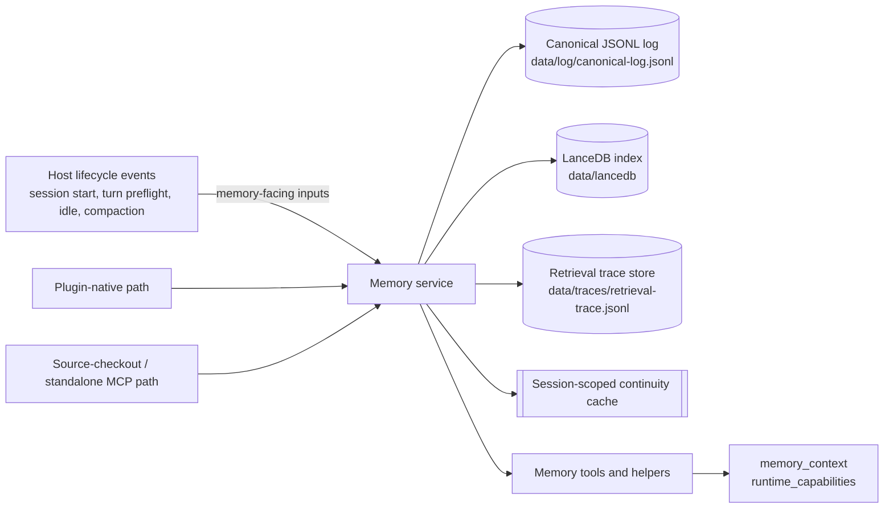
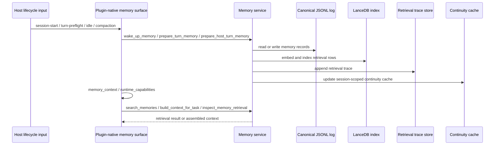

# Architecture

## วัตถุประสงค์

`mahiro-mcp-memory-layer` คือโครงสร้างพื้นฐานด้าน memory และ retrieval แบบ local-first สำหรับ OpenCode. ตัวแพ็กเกจให้ทั้ง memory records, document-shaped sources, retrieval, context assembly, review, diagnostics, การ inspect continuity cache, และ lifecycle continuity.

## สภาพปัจจุบัน

- แพ็กเกจนี้เป็น memory-only.
- cocoindex-code owns source, docs, and code corpus indexing; `mahiro-mcp-memory-layer` owns curated memory only.
- Do not use this package as a source, docs, or code corpus indexer.
- เส้นทาง published plugin ได้ stable memory tool surface พร้อม `memory_context` และ `runtime_capabilities`.
- เส้นทาง source-checkout และ standalone MCP เปิด tool ชุดเดียวกันที่โฟกัส memory แต่ไม่ได้ทำให้ repo นี้กลายเป็น hook runtime.
- Host lifecycle events ถูกใช้เป็น input ที่หันเข้าหา memory เท่านั้น เพื่อรองรับ continuity.
- `memory-console` เป็น local memory management UI ภายในขอบเขตแพ็กเกจนี้ ไม่ใช่ hosted admin plane หรือ workflow control surface.

## ขอบเขตความรับผิดชอบ

สิ่งที่รับผิดชอบ:

- durable memory writes
- retrieval และ search
- context assembly
- retrieval diagnostics
- memory review และ save policy flows
- document-shaped memory handling
- memory lifecycle continuity
- local memory console UI สำหรับ browse, review, quarantine, guarded rejected cleanup, และ graph inspection

สิ่งที่ไม่รับผิดชอบ:

- workflow control
- worker routing
- task lifecycle state
- supervision
- executor ownership
- hook dispatch

## Runtime surfaces

### เส้นทางของ plugin-native

นี่คือเส้นทางเริ่มต้นของ published plugin โดยเปิด memory tools แบบ in-process และเพิ่ม:

- `memory_context`
- `runtime_capabilities`

`runtime_capabilities` อยู่ในขอบเขตของ memory เท่านั้น และรายงาน current plugin-native memory contract: tool names, lifecycle flags, และ memory protocol guidelines.

### เส้นทาง standalone หรือ source-checkout MCP

tool family ที่โฟกัส memory ชุดเดียวกันเปิดใช้ได้จาก source checkout หรือ standalone server และ surface ยังเป็น memory-only เหมือนเดิม.

### Local memory console

`bun run memory-console` เปิด UI local-only สำหรับ memory browsing, review management, rejected quarantine, guarded purge, และ graph inspection.

Graph ที่ console แสดงเป็น derived projection จาก metadata ของ memory records เท่านั้น, read-only, และไม่ถูกเก็บเป็น canonical source of truth.

Rejected purge เป็นเส้นทางเฉพาะสำหรับ records ที่ rejected แล้ว และต้องมี confirmation explicit ก่อนทำงาน. ไม่ใช่ default cleanup path.

## กลุ่มเครื่องมือ

- งานเขียนและคัดกรอง, `remember`, `upsert_document`, `promote_memory`, `review_memory`
- งานค้นหาและประกอบ context, `search_memories`, `build_context_for_task`, `inspect_memory_retrieval`
- งานคิวและนโยบาย, `list_memories`, `list_review_queue`, `list_review_queue_overview`, `get_review_assist`, `enqueue_memory_proposal`, `suggest_memory_candidates`, `apply_conservative_memory_policy`
- ตัวช่วยด้าน continuity, `memory_context`, `runtime_capabilities`, `wake_up_memory`, `prepare_turn_memory`, `prepare_host_turn_memory`

## โมเดลการเก็บและการดึงข้อมูล

- Canonical memory records ลงใน JSONL log ที่ `data/log/canonical-log.jsonl`.
- Retrieval rows อยู่ใน LanceDB index ที่ `data/lancedb`.
- Embeddings เป็น deterministic และมี versioned output จาก `DeterministicEmbeddingProvider`.
- Retrieval traces ถูก append ไปที่ `data/traces/retrieval-trace.jsonl`.
- Session continuity อยู่ใน session-scoped continuity cache แยกจาก durable records.

Retrieval และ context assembly อ่านจาก indexed retrieval rows ก่อน แล้วค่อย emit trace records สำหรับ hit, miss, degraded, และ provenance inspection. continuity cache ไม่ใช่ durable storage.

### Scope identity

Plugin-native project memory uses a canonical scope identity so records, retrieval rows, and traces can agree on the same workspace boundary. The current canonical shape is:

- `projectId`: stable OpenCode project name, falling back to OpenCode project id when the name is unavailable.
- `containerId`: `workspace:/absolute/path`, derived from the resolved worktree or directory path.

Older data may contain `worktree:/absolute/path` or `directory:/absolute/path`. Scoped reads treat those values as aliases for the matching `workspace:/absolute/path`, while the `rewrite-scope-identity` maintenance command can rewrite canonical log metadata and reindex derived retrieval rows. Global records should not carry project/container metadata.

## Source-of-truth hierarchy

ลำดับความจริงของข้อมูลใน repo นี้คือ:

1. raw or original materials, when they exist upstream
2. canonical reviewed memory records
3. derived retrieval index
4. generated wiki projection
5. runtime cache and traces

Generated wiki files are derived artifacts, not canonical source data. They exist as a projection of reviewed memory records.

Wiki materialization does not bidirectionally sync with wiki editors, and it does not import wiki output back into memory in the MVP.

The projection excludes `memory_context` continuity cache data and retrieval traces. Those belong to runtime diagnostics and continuity, not to wiki materialization.

## Authority and evidence policy

- Ownership, truth status, freshness, and retrieval eligibility are separate axes.
- Human and agent factual claims are hypotheses until promoted with evidence.
- Preferences may be authoritative as user intent, but they are not empirical verification for code, API, product, or external-world facts.
- Retrieval traces are diagnostics unless a specific review or promotion flow cites them as evidence; they are not canonical memory truth.
- Rejected records stay out of normal retrieval/context, but remain available for review hygiene, audit, quarantine, and duplicate suppression surfaces.

## โมเดล lifecycle

คำศัพท์ของ lifecycle มีดังนี้:

- `session-start-wake-up`
- `turn-preflight`
- `idle-persistence`
- `compaction-continuity`

stages เหล่านี้เตรียมเฉพาะ memory continuity เท่านั้น. Compaction continuity เป็นแบบ append-only และ fail-open จึงทำให้ memory continuity เดินต่อได้ แม้ backend write จะไม่สำเร็จ.

## โมเดลการวินิจฉัย

- `memory_context` ใช้ inspect session-scoped continuity cache และ memory diagnostics.
- `inspect_memory_retrieval` อธิบายข้อมูล hit, miss, degraded, query, และ provenance.
- `runtime_capabilities` รายงาน current plugin-native memory contract รวมถึง tool names, lifecycle flags, และ memory protocol guidelines.
- `memory-console` แสดง browse/read-only graph projection และ management routes โดยไม่ขยายขอบเขตไปยัง workflow control หรือ executor ownership.

เมื่อ retrieval ส่งกลับ `returnedMemoryIds: []`, `contextSize: 0`, และ `degraded: false` นั่นคือ `empty_success` ไม่ใช่ `degraded_retrieval`. `contextSize` คือ returned item payload size, `content.length` บวก `summary.length` เมื่อมี summary, ไม่ใช่ rendered context length และไม่ใช่ continuity-cache size.

`inspect_memory_retrieval` รับ public input เป็น `requestId` เท่านั้น. ถ้า plugin path เรียกแบบไม่มี `requestId`, runtime อาจ inject latest scoped lookup metadata ภายในและส่ง `latestScopeFilter` ออกมาเป็น diagnostic metadata เมื่อ scoped latest lookup empty. `latestScopeFilter` จึงไม่ใช่ public input contract.

## นโยบาย review และ save

memory writes สามารถถูกเสนอ, review, และ promote ได้.

- `suggest_memory_candidates` และ `enqueue_memory_proposal` ใช้ surface candidates.
- `apply_conservative_memory_policy` คุมพฤติกรรมการ save ให้อยู่ในกรอบของ memory acceptance.
- `review_memory` สามารถ reject, defer, หรือ edit แล้วค่อย promote ได้.
- `promote_memory` ทำเครื่องหมาย record ว่า verified และ refresh retrieval row.

Save policy ยังคงอยู่ใน memory boundary และไม่กลายเป็น workflow control.

### Review freshness semantics

Advisory review hints use evidence freshness, not operational recency. For `possible_supersession`, freshness is based on `verifiedAt ?? createdAt`:

- `verifiedAt` is the evidence-origin time for verified records.
- `createdAt` is the proposal or ingestion evidence fallback when a verified record has no `verifiedAt`, or when a pending hypothesis has not been verified yet.
- `updatedAt` is bookkeeping time for review actions, reindexing, queue ordering, or other workflow mutations. It must not make a record look like newer evidence.

This keeps supersession hints reviewer-facing and advisory. They identify memories that may need evidence review; they do not decide truth or automatically replace verified memory.

## อิทธิพลจาก MemPalace โดยไม่คัดลอก

แนวคิดจาก memory-system ก่อนหน้ามีอิทธิพลต่อวินัยของที่นี่ โดยเฉพาะการแยก durable records, derived retrieval data, และ continuity handling. แต่ repo นี้ไม่ได้คัดลอก public vocabulary หรือภาษาของ hierarchy จากระบบนั้นมาใช้ตรง ๆ. เราใช้คำเรียกที่เป็น memory-native ของตัวเอง เช่น memory records, document-shaped sources, retrieval, context assembly, review, diagnostics, และ lifecycle continuity.

## ตารางปรับใช้แนวคิดจาก MemPalace

ส่วนนี้สรุปให้ชัดว่าแนวคิดหลักห้ากลุ่มถูกแปลงเข้ามาอย่างไรใน repo ที่ยังคง memory-only และ host lifecycle events ยังเป็น memory-facing inputs เท่านั้น

| แนวคิด | สถานะ | ความหมายใน repo นี้ |
| --- | --- | --- |
| Memory Stack | adapted | ใช้เป็น layered context assembly ผ่าน `startup brief`, `wake_up_memory`, `build_context_for_task`, `search_memories`, และ retrieval traces |
| Knowledge Graph | deferred | ยังไม่ใช่ graph; ตอนนี้รับได้แค่ review hints แบบ temporal หรือ supersession |
| AAAK Dialect | deferred | อนาคตอาจมี compact rendering แบบเลือกใช้ได้ แต่ไม่ใช่ storage default |
| Specialist Agents | adapted | ใช้ได้เฉพาะเป็น actor-attributed metadata convention, ไม่มี registry หรือ routing |
| Contradiction Detection | adapted | ใช้ได้เฉพาะเป็น advisory review hints, ไม่มี truth engine |

สิ่งที่อยู่นอกตารางนี้ยังคงยึดคำศัพท์ของ repo เอง เช่น memory records, document-shaped sources, retrieval, context assembly, review, diagnostics, และ lifecycle continuity. ถ้าข้อเสนอใดพยายามยก host behavior ไปเป็น workflow control, worker routing, task lifecycle, supervision, executor ownership, hook dispatch, หรือทำให้ graph/purge กลายเป็น canonical หรือ default write path ให้ถือว่าไม่อยู่ในขอบเขตของแพ็กเกจนี้.

## Actor-attributed memory convention / ข้อตกลง actor-attributed memory

ข้อตกลงนี้เป็น metadata convention เท่านั้น ไม่ใช่ registry, routing, ownership, หรือ specialist-agent infrastructure.

- `source.title` ใช้รูปแบบ `agent:<stable-name>` หรือ `actor:<stable-name>`
- `tags` ต้องมี `actor:<stable-name>` และอาจมี `diary` ได้ถ้าต้องการช่วยค้นคืน
- `kind` ต้องใช้ค่าที่มีอยู่แล้ว คือ `conversation`, `decision`, `fact`, หรือ `task`
- `summary` ใช้สรุปเหตุผลหรือแพทเทิร์นแบบสั้น
- `content` เป็นบันทึกถาวรด้วยภาษาปกติ ไม่ใช้ AAAK

ข้อตกลงนี้ช่วยติดป้ายแหล่งที่มาและเจตนาของ memory record ได้ โดยไม่เปลี่ยนความหมายของ memory model หรือขอบเขตการทำงานของ repo นี้.

## เงื่อนไขสำหรับอนาคตเท่านั้น

สิ่งที่ยังไม่ shipped วันนี้:

- raw or verbatim memory replay
- a knowledge graph
- source-to-derived fanout as a public contract

ถ้าอนาคตมีสิ่งเหล่านี้เข้ามา จะต้องมี privacy review, redaction policy, explicit review flow, source pointer semantics, และ scope rules ที่แยก raw กับ derived records ให้ชัดเจน.

## การตรวจสอบและเช็ก drift

ให้เช็กสิ่งเหล่านี้เมื่อมีการเปลี่ยน architecture surface:

- `bun run typecheck`
- `bun run test`
- `bun run build`
- `bun run reindex` when embeddings or retrieval indexing change
- ยืนยันว่า `memory_context` และ `runtime_capabilities` ยังตรงกับ documented memory contract
- ยืนยันว่า host lifecycle handling ยังเป็น memory-facing only
- ยืนยันว่าไม่มี workflow-control responsibility ถูกยัดเข้ามาใต้ชื่อที่ดูเป็น memory-facing
